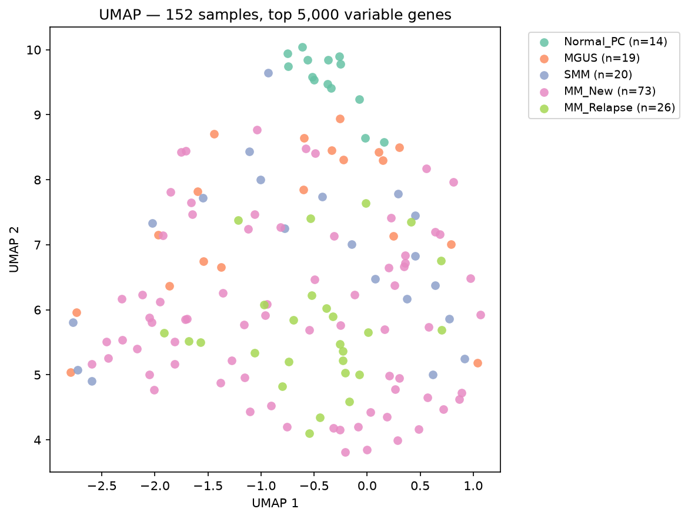
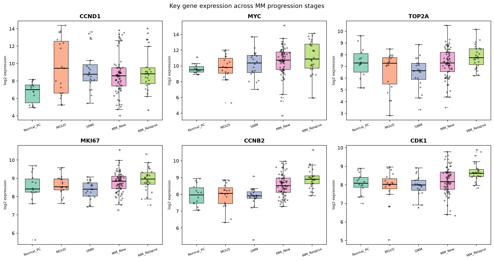

# Myeloma Progression Transcriptomics

Gene expression analysis of Multiple Myeloma disease progression using the **GSE6477** public dataset — 152 patient samples, 5 disease stages.

> **Status: Active development** — core analysis complete, additional validation in progress.

---

## What is this?

Multiple Myeloma is a blood cancer that develops gradually through distinct stages. This project asks a simple question: **can gene activity in a patient's bone marrow tell us how far along the disease has progressed?**

Think of genes as dials. This analysis reads 13,237 dials from 152 patients and looks for which ones change — and when — as the disease worsens.

---

## The disease stages

```
Normal  -->  MGUS  -->  SMM  -->  MM (New)  -->  MM (Relapsed)
(healthy)  (early warning) (smoldering) (active cancer)  (returned)
```

| Stage | Plain English | Patients in dataset |
|---|---|---|
| Normal PC | Healthy bone marrow plasma cells | 14 |
| MGUS | Abnormal protein detected, no symptoms yet | 19 |
| SMM | More abnormal cells, still no organ damage | 20 |
| MM (New) | Active myeloma — newly diagnosed | 73 |
| MM (Relapsed) | Cancer returned after treatment | 26 |

---

## Key findings

### 1. Normal cells look completely different from diseased cells

When we plot all 152 patients in 2D (based on their gene activity), healthy cells cluster far away from every disease stage:


*Each dot is one patient. Colour = disease stage. Normal plasma cells (blue) sit apart — they have a fundamentally different gene expression profile from every disease stage.*

A machine learning classifier trained on this separation achieves **99.3% accuracy** (AUC = 1.000) in distinguishing normal from diseased — and improves to **100%** after removing genes that may reflect bone marrow cell-type contamination rather than cancer biology.

### 2. The biggest gene expression changes happen at the very first step

| Transition | Genes significantly changed |
|---|---|
| Normal → MGUS (first step) | **476** |
| MGUS → SMM | 0 |
| SMM → MM (New) | 3 |
| MM (New) → MM (Relapsed) | 0 |

The transformation from healthy to pre-cancerous is the sharpest molecular event. After that, the cancer deepens gradually with no clear gene-level boundary — which is why early detection matters.

Key genes driving this — and rising further with each stage:


*Each box shows gene activity levels (y-axis) across the 5 stages (x-axis). TOP2A, MKI67, and CDK1 are all involved in cell division — they go up as the cancer progresses, reflecting runaway cell growth.*

### 3. Whole biological programmes are disrupted

Beyond individual genes, entire pathways (coordinated groups of genes) shift across the progression:

| Transition | Pathways significantly changed |
|---|---|
| Normal → MGUS | 27 |
| MGUS → SMM | 20 |
| SMM → MM (New) | 34 |
| MM (New) → MM (Relapsed) | 24 |

Notable patterns:
- **Cell division machinery** (E2F Targets, G2M Checkpoint, Myc Targets) ramps up steadily across all stages
- **Immune surveillance** (TNF-α/NF-κB, Complement) is suppressed from the very first step
- **Protein Secretion** — the antibody-making function that defines a healthy plasma cell — is dampened early and stays down

### 4. A machine learning model can score disease progression

A model trained on all 5 stages assigns each patient a continuous "progression score" from 0 to 4. The scores increase monotonically across stages:

| Stage | Average progression score |
|---|---|
| Normal PC | 0.72 |
| MGUS | 1.95 |
| SMM | 2.43 |
| MM (New) | 2.76 |
| MM (Relapsed) | 2.90 |

Spearman correlation with true stage order: **ρ = 0.692**. The 5-class classifier correctly stages patients within 1 stage **94.7%** of the time.

### 5. The signals survive a contamination check

Bone marrow biopsies contain a mix of cell types. We tested whether the findings were real cancer biology or an artefact of different immune cell proportions in the samples:

- 94 of 238 genes (39%) flagged as potentially contaminated by granulocyte immune cells
- After removing all 97 suspect genes: **25 of 27 pathways still significant**
- The 2 pathways lost (Coagulation, Apical Junction) were the weakest to begin with
- Protein Secretion — a core plasma cell function — actually *strengthened* after the cleanup

---

## How to reproduce this

```bash
git clone https://github.com/Yash-Kunwar/Myeloma-Progression-Transcriptomics.git
cd Myeloma-Progression-Transcriptomics
pip install -r requirements.txt
# Run: eda.ipynb --> analysis.ipynb --> ml.ipynb
# Raw data (~27 MB) downloads automatically from NCBI GEO on first run
```

| Notebook | Does |
|---|---|
| [eda.ipynb](eda.ipynb) | Data loading, quality checks, PCA |
| [analysis.ipynb](analysis.ipynb) | Differential expression, pathway analysis, UMAP, purity correction |
| [ml.ipynb](ml.ipynb) | All machine learning models and evaluations |

---

## Methods (brief)

| Step | Approach |
|---|---|
| Differential expression | Welch's t-test + Benjamini-Hochberg FDR correction |
| Pathway analysis | Pre-ranked GSEA, MSigDB Hallmark gene sets |
| Dimensionality reduction | UMAP on top 5,000 variable genes |
| Classification | Logistic Regression + Random Forest, 5-fold cross-validation |
| Ordinal staging | Frank-Hall binary decomposition |
| Contamination check | Granulocyte marker correlation + hypergeometric test |

---

## Trajectory

- **Rigorous purity correction** — regress out contamination across all genes simultaneously (covariate adjustment), not just remove the flagged ones
- **SMM detection** — improve classification of the smoldering stage, which currently has no sharp gene expression boundary
- **External validation** — reproduce findings on an independent MM dataset (e.g. GSE2658 or CoMMpass)
- **Biological follow-up** — network analysis of leading-edge genes to identify hub drivers of progression
- **Risk score** — extend the progression score to include per-sample confidence intervals

---

## License

This project uses the publicly available GSE6477 dataset. Code is released under the MIT License.
