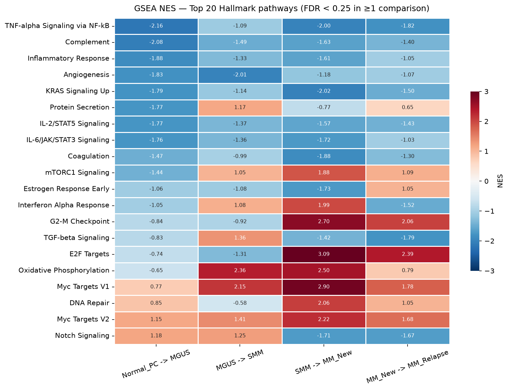
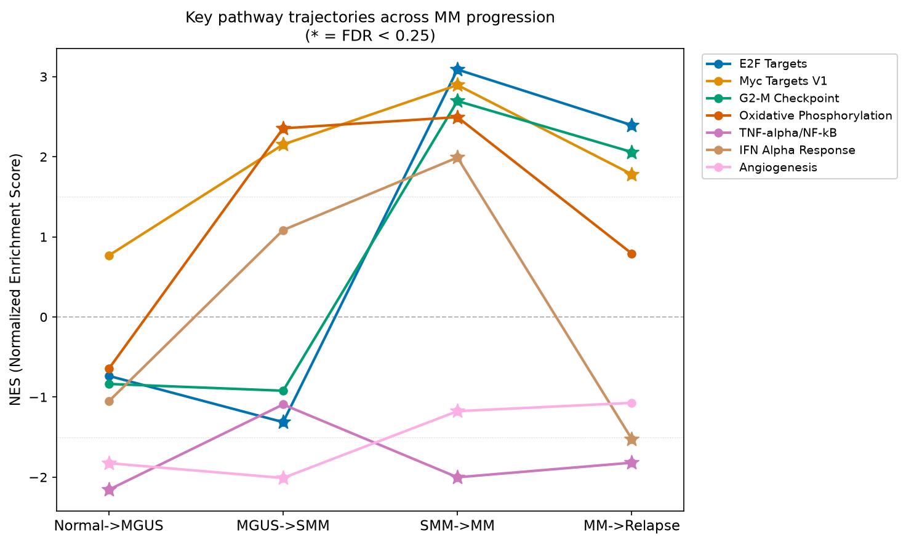
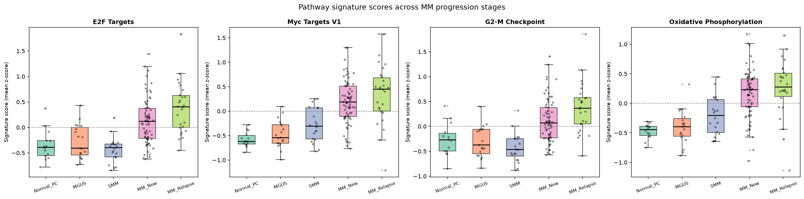
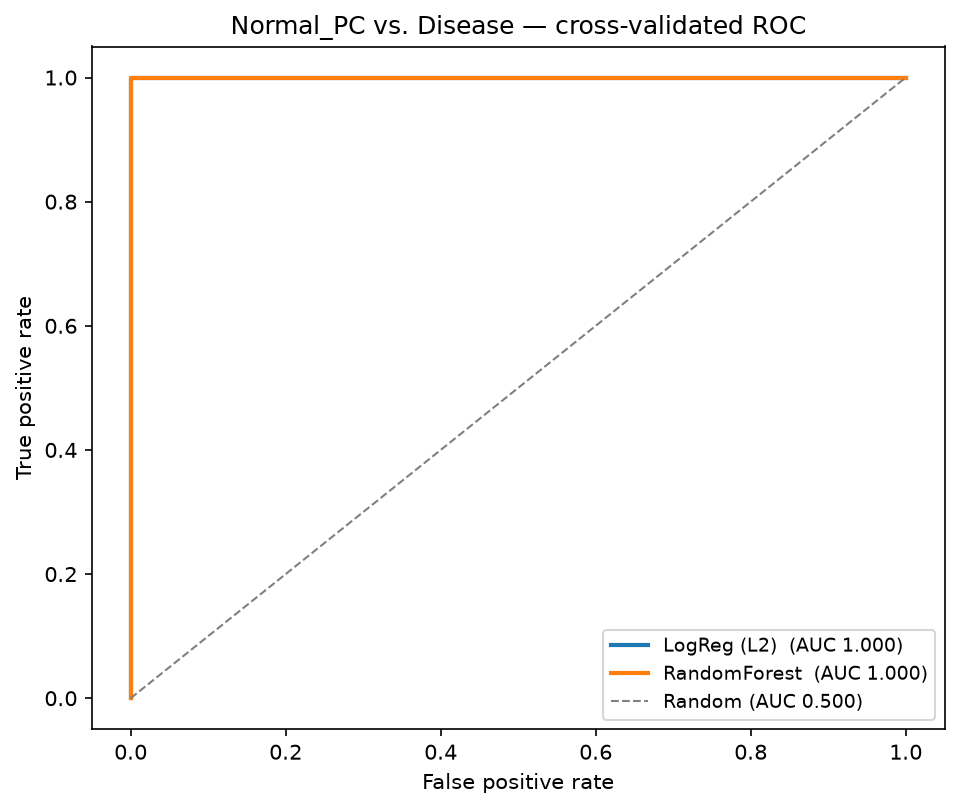
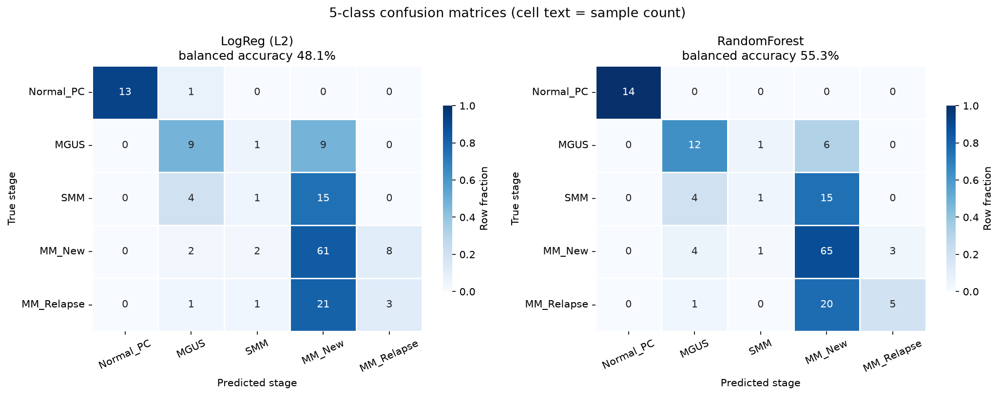
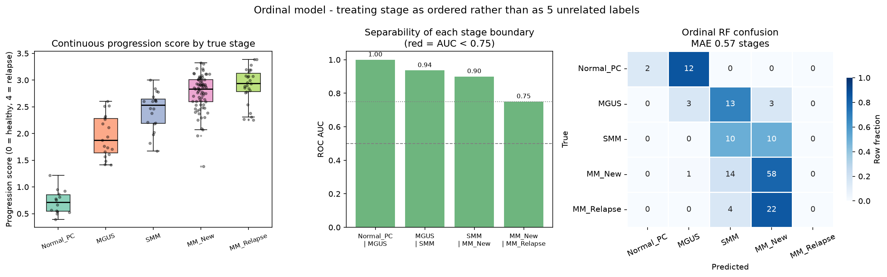
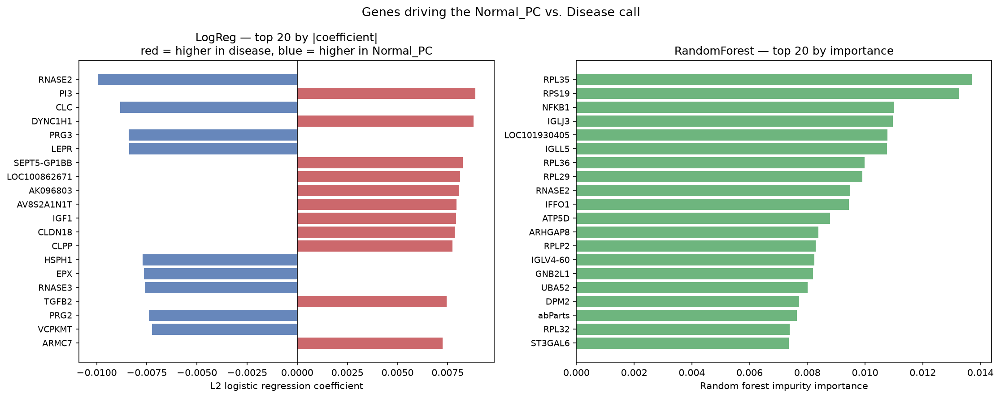

# Myeloma Progression Transcriptomics

Gene expression analysis of Multiple Myeloma disease progression using the **GSE6477** public dataset (Affymetrix HG-U133A microarray, 152 patient samples across 5 disease stages).

> **Status: Active development** — core analysis complete, additional validation in progress.

---

## What is this project?

Multiple Myeloma (MM) is a blood cancer that starts as a pre-cancerous condition and progresses through distinct stages. This project asks: **can we see that progression in gene expression data?**

Using 152 bone marrow biopsy samples from patients at different stages of the disease, this analysis:
- Identifies which genes turn on or off at each stage transition
- Finds which biological pathways are activated or suppressed
- Builds machine learning models that distinguish healthy plasma cells from malignant ones
- Investigates whether the signals are genuine cancer biology or artefacts from sample contamination

---

## Dataset

| Property | Value |
|---|---|
| GEO Accession | [GSE6477](https://www.ncbi.nlm.nih.gov/geo/query/acc.cgi?acc=GSE6477) |
| Platform | Affymetrix HG-U133A |
| Samples after QC | 152 |
| Genes after QC | 13,237 |
| Disease stages | Normal PC, MGUS, SMM, MM (newly diagnosed), MM (relapsed) |

> Data is downloaded automatically by GEOparse on first run — not stored in this repository.

### Sample distribution

| Stage | Description | n |
|---|---|---|
| Normal PC | Healthy plasma cells | 14 |
| MGUS | Pre-cancer, no symptoms | 19 |
| SMM | Smoldering — more abnormal cells, still no damage | 20 |
| MM (New) | Active myeloma, newly diagnosed | 73 |
| MM (Relapsed) | Returned after treatment | 26 |
| **Total** | | **152** |

### Disease progression

```
Normal Plasma Cell --> MGUS --> SMM --> MM (Newly Diagnosed) --> MM (Relapsed)
     (healthy)      (pre-cancer) (smoldering)  (active cancer)     (returned)
```

- **MGUS** — Monoclonal Gammopathy of Undetermined Significance: abnormal protein in blood, no symptoms
- **SMM** — Smoldering Multiple Myeloma: more abnormal cells, still no organ damage
- **MM** — Active disease causing bone damage, kidney problems, or anemia

---

## Notebooks

| Notebook | What it does |
|---|---|
| [eda.ipynb](eda.ipynb) | Exploratory data analysis: sample QC, PCA, stage distributions |
| [analysis.ipynb](analysis.ipynb) | Differential expression, GSEA pathway analysis, UMAP, purity correction |
| [ml.ipynb](ml.ipynb) | Machine learning: binary Normal vs Disease classifier, 5-class staging, ordinal progression score |

---

## Results

### Differential expression

Genes significantly changed between stages (FDR < 0.05, |log2FC| > 1):

| Comparison | Samples (A vs B) | Up in B | Down in B | Total DE genes |
|---|---|---|---|---|
| Normal PC vs MGUS | 14 vs 19 | 238 | 238 | 476 |
| MGUS vs SMM | 19 vs 20 | 0 | 0 | 0 |
| SMM vs MM (New) | 20 vs 73 | 1 | 2 | 3 |
| MM (New) vs MM (Relapsed) | 73 vs 26 | 0 | 0 | 0 |

> The Normal PC → MGUS transition dominates. MGUS → SMM and MM (New) → MM (Relapsed) have zero individually significant DE genes — these transitions sit on a continuum with no sharp expression boundary.

### GSEA pathway analysis

Hallmark pathways significantly enriched or suppressed (FDR < 0.25):

| Comparison | Significant pathways | Activated (NES+) | Suppressed (NES-) |
|---|---|---|---|
| Normal PC vs MGUS | 27 | 1 | 26 |
| MGUS vs SMM | 20 | 10 | 10 |
| SMM vs MM (New) | 34 | 12 | 22 |
| MM (New) vs MM (Relapsed) | 24 | 6 | 18 |

**Key pathways across progression:**

| Pathway | Direction | Biological meaning |
|---|---|---|
| E2F Targets, G2M Checkpoint, Myc Targets | Increasingly activated | Cell division machinery ramping up |
| Oxidative Phosphorylation | Activated in MM | Cancer cells consuming more energy |
| TNF-alpha / NF-kB Signalling | Suppressed in MGUS | Immune signalling turned down early |
| Complement | Suppressed in MGUS | Immune surveillance reduced |
| Protein Secretion | Suppressed in MGUS (strengthens after purity correction) | Antibody-making machinery — core plasma cell function |


*Heatmap of normalised enrichment scores (NES) for the top 20 Hallmark pathways across all 4 stage comparisons. Red = activated, blue = suppressed.*


*Seven key pathways tracked across all stage transitions. Stars mark FDR < 0.25.*

### Key gene expression


*Expression of six cancer-relevant genes across the 5 stages. Cell cycle genes (TOP2A, MKI67, CDK1) rise sharply in MM.*

### Signature scores


*Per-sample mean z-score for leading-edge genes from 4 key pathways (SMM vs MM comparison). Each dot is one patient.*

### Sample clustering (UMAP)


*UMAP on the 5,000 most variable genes. Normal PC separates cleanly from disease stages. MGUS, SMM, and MM (New) overlap — consistent with a continuous progression rather than discrete jumps.*

---

### Machine learning

#### Binary classification: Normal PC vs all disease stages

| Model | Features | Accuracy | Balanced Acc | AUC | Normal correctly found |
|---|---|---|---|---|---|
| Majority class baseline | — | 90.8% | 50.0% | 0.500 | — |
| Logistic Regression (L2) | All 13,237 genes | 99.3% | 96.4% | 1.000 | 13 / 14 |
| Random Forest | All 13,237 genes | 99.3% | 96.4% | 1.000 | 13 / 14 |
| Logistic Regression (L2) | Purity-filtered (13,140 genes) | **100.0%** | **100.0%** | 1.000 | 14 / 14 |
| Random Forest | Purity-filtered (13,140 genes) | 99.3% | 96.4% | 1.000 | 13 / 14 |

> After removing 97 granulocyte-contaminated genes, Logistic Regression achieves perfect separation. The signal is genuine plasma-cell biology, not contamination.


*ROC curves for both binary classifiers. AUC = 1.000 across 5-fold cross-validation.*

#### 5-class staging across all disease stages

| Model | Exact accuracy | Adjacent accuracy | MAE (stages) | Cohen's Kappa |
|---|---|---|---|---|
| Baseline (always predict MM New) | 48.0% | 78.3% | 0.829 | 0.000 |
| Random Forest (nominal) | **63.8%** | 92.8% | **0.441** | **0.763** |
| Ordinal RF (Frank-Hall) | 48.0% | **94.7%** | 0.572 | 0.650 |

> Adjacent accuracy (prediction within 1 stage) reaches 94.7% with the ordinal model. SMM remains the hardest stage — it produces no distinct gene expression signature and splits evenly between SMM and MM (New).


*5-fold cross-validated confusion matrix for the 5-class Random Forest. Rows = true stage, columns = predicted stage.*

#### Ordinal progression score

The Frank-Hall binary decomposition outputs a continuous score (0–4) representing how far along the progression each sample sits:

| Stage | Mean progression score |
|---|---|
| Normal PC | 0.72 |
| MGUS | 1.95 |
| SMM | 2.43 |
| MM (New) | 2.76 |
| MM (Relapsed) | 2.90 |

Spearman correlation between score and true stage order: **ρ = 0.692**


*Progression score distributions per stage and per-boundary AUC values.*

#### Feature importance


*Top 20 genes by Random Forest feature importance (binary classifier, refit on all samples for ranking only).*

---

### Purity confound investigation

Bone marrow biopsies contain a mix of cell types. Normal PC samples have more granulocytes (a type of immune cell) than disease samples, which could make healthy and diseased samples look different for the wrong reason.

| Check | Result |
|---|---|
| Genes down in Normal PC → MGUS | 238 |
| Of those, correlated with granulocyte markers | 94 (39%) |
| Genes excluded (flagged + 12 granulocyte markers) | 97 |
| GSEA pathways significant before purity filter | 27 |
| GSEA pathways significant after purity filter | 27 |
| Pathways that survived | 25 |
| Pathways lost | 2 (Coagulation, Apical Junction) |
| Pathways newly significant | 2 |

> **Conclusion:** 25 of 27 pathways are real biology. The two lost pathways (Coagulation, Apical Junction) were the weakest in the original list. Protein Secretion — a core plasma cell function — actually *strengthened* after removing contamination.

---

## Reproducing this analysis

```bash
# Clone the repo
git clone https://github.com/Yash-Kunwar/Myeloma-Progression-Transcriptomics.git
cd Myeloma-Progression-Transcriptomics

# Install dependencies (Python 3.10+)
pip install -r requirements.txt

# Run notebooks in order: eda --> analysis --> ml
# GEO data (~27 MB) downloads automatically on first run
```

---

## Repository structure

```
.
+-- eda.ipynb                     # Exploratory analysis
+-- analysis.ipynb                # Main biological analysis
+-- ml.ipynb                      # Machine learning models
+-- requirements.txt              # Python dependencies
+-- results/
|   +-- figures/                  # All generated plots
|   +-- pathways/                 # GSEA results (CSV)
|   +-- ml/                       # ML metrics and predictions
|   +-- *.csv                     # Differential expression results
+-- AGENTS.md                     # Analysis methodology guidelines
```

---

## Methods summary

| Step | Method |
|---|---|
| Differential expression | Welch's t-test, Benjamini-Hochberg FDR (threshold: FDR < 0.05, \|log2FC\| > 1) |
| Pathway analysis | Pre-ranked GSEA, MSigDB Hallmark gene sets, 1000 permutations (gseapy) |
| Dimensionality reduction | UMAP on top 5,000 most variable genes |
| Binary classification | Logistic Regression (L2) + Random Forest, 5-fold stratified CV, balanced weights |
| 5-class staging | Random Forest, same CV setup |
| Ordinal modelling | Frank-Hall binary decomposition across 4 stage thresholds |
| Purity correction | Granulocyte marker correlation + hypergeometric enrichment test |

---

## Trajectory

**Purity correction (rigorous)**
- Implement covariate adjustment: regress granulocyte contamination scores out of all 13,237 genes simultaneously, rather than removing the worst offenders. This is the standard method and a strictly stronger test than the current gene-exclusion approach.

**Staging model improvements**
- Improve SMM detection — currently the hardest stage to classify (sits on a continuum with no discrete expression boundary). Possible approaches: continuous progression score thresholding, survival-informed labelling if outcome data is available.
- Characterise the 2 pathways that became newly significant after purity correction.

**Validation**
- Reproduce key findings on an independent MM dataset (e.g. GSE2658 or CoMMpass) to test whether the progression score and pathway signatures generalise beyond GSE6477.

**Biological follow-up**
- Deep-dive into the Protein Secretion pathway strengthening after purity correction — this is a core plasma cell function and may represent a genuine early cancer signal worth investigating.
- Network analysis of the leading-edge genes from the top GSEA pathways to identify hub genes driving progression.

**Technical**
- Covariate-adjusted GSEA for all 4 stage comparisons, not just Normal PC vs MGUS.
- Extend the ordinal progression score to a continuous risk score with confidence intervals per sample.

---

## License

This project uses the publicly available GSE6477 dataset. Code is released under the MIT License.
